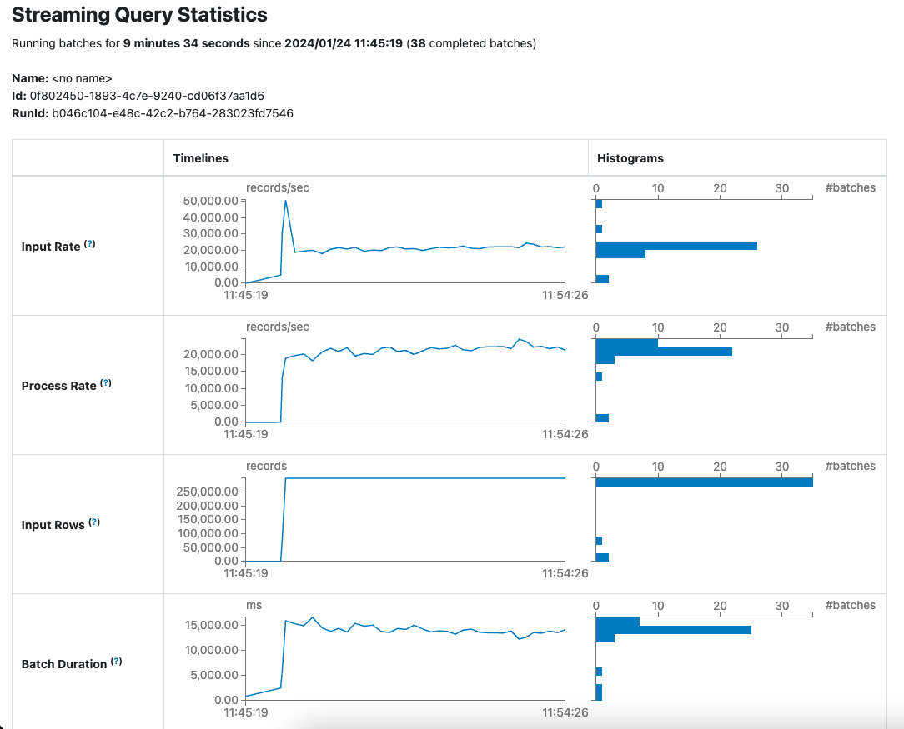
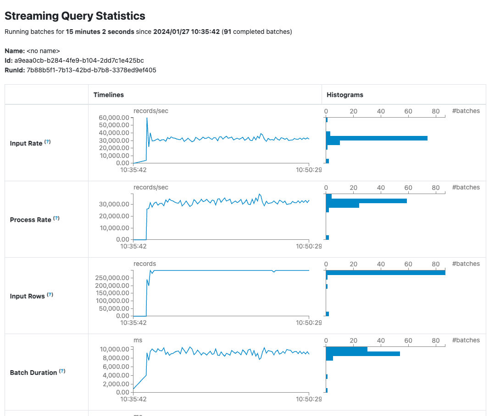
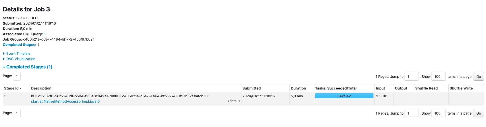
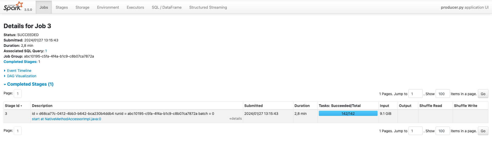
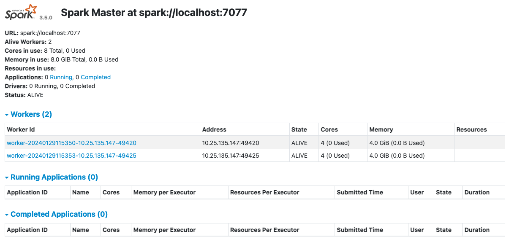
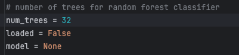
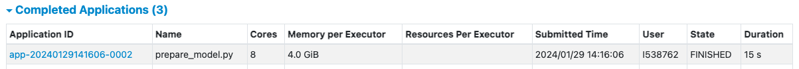

# Online Fraud Detection on Credit Card Transactions
This repository contains our project for the course "Big Data and Advanced Database System Concepts" at [Hochschule Karlsruhe](https://www.h-ka.de/) in the winter term 23/24.

We use a [Synthetic Credit Card Transaction Generator](https://github.com/namebrandon/Sparkov_Data_Generation/tree/b5eb45c89d36f2aa4ef16044a42945bed8b96d93) to generate synthetic credit card transactions that contain a label indicating fraud.
Based on these data we build two pipelines.
One for an offline training of a Random Forest Classifier, the other for an online fraud detection based on the previously trained Random Forest Classifier.

## Infrastructure Requirements
- only Mac is supported
- at least [Python 3.12.0](https://www.python.org/downloads/)
- [Docker Desktop](https://docs.docker.com/desktop/install/mac-install/) for Mac
- easiest to navigate with [PyCharm](https://www.jetbrains.com/pycharm/)
- at least [Apache Spark 3.5.0](https://spark.apache.org/downloads.html) (package type: Pre-built for Apache Hadoop 3.3 and later)

## Environment Variables
```bash
SPARK_HOME=path/to/Spark
PATH=path/to/Spark/bin
PATH=path/to/python3/version/bin
PYSPARK_DRIVER_PYTHON=python3
```

## Installation

1. Clone the repo
```bash
git clone https://github.com/antoniafeistel/BigData.git
```
2. Create a virtual environment
```bash
python3 -m venv path/to/new/virtual/environment/my_venv
```

3. Activate your virtual environment
```bash
source my_venv/bin/activate
```

4. Install requirements
```bash
pip install -r BigData/requirements.txt
```

5. Install provided Python packages
```bash
pip install -e BigData/.
```

6. Clone used submodule
```bash
git submodule update --init
```

## Architecture


## Scalability Model for the Streaming-Pipeline
For the streaming-pipeline, all components (Producer, Kafka cluster, Consumer) can be independently scaled. Thus, our architecture enables a high degree of parallelization and fault tolerance.
Moreover, fault tolerance is further improved by the topic partitions and replications used in the Kafka cluster.


## Dependency Graph


## Application Workflow

#### 1. Step: Start the Spark Cluster
Run the [start_spark.py](https://github.com/antoniafeistel/BigData/blob/main/scripts/start_spark.py) script to start the Spark cluster.\
Web UIs will be available under: "localhost:8080" and "localhost:4040".

#### 2. Step: Generate synthetic credit card transaction data for model training
You can skip step 2 and 3 if you want to use the pre-trained Random Forest Classifier (see next paragraph: Pre-trained Random Forest Classifier).

Customize the data generation within the "# Transactions generation" section of the [.env-file](https://github.com/antoniafeistel/BigData/blob/main/scripts/.env).\
However, set GEN_MODE = "train" in any case.

Run the [generate_transactions.py](https://github.com/antoniafeistel/BigData/blob/main/scripts/generate_transactions.py) script to generate synthetic credit card transaction data.\
The generated data will be saved in the respective "BigData/resouces/data/train/raw/dd_mm_yyyy_hh_mm_ss" folder.

#### 3. Step: Train the Random Forest Classifier
Set DATA_VERSION = "dd_mm_yyyy_hh_mm_ss" in the [.env-file](https://github.com/antoniafeistel/BigData/blob/main/scripts/.env) to use the respective synthetic credit card transaction data generated in step 2 for training the Random Forest Classifier.

You can customize the number of decision trees used for training the Random Forest Classifier by setting "num_trees" in [model_utils.py](https://github.com/antoniafeistel/BigData/blob/main/model/model_utils.py).\
Otherwise, the Random Forest Classifier will be trained based on 128 decision trees.

Run the [train_model.py](https://github.com/antoniafeistel/BigData/blob/main/scripts/train_model.py) script to train the Random Forest Classifier.\
The trained Random Forest Classifier will be saved in the respective "BigData/resources/models/dd_mm_yyyy_hh_mm_ss" folder.

#### 4. Step: Start the Kafka Cluster
Set DOCKER_HOST_IP to your IP address in the "# Kafka" section of the [.env-file](https://github.com/antoniafeistel/BigData/blob/main/scripts/.env).\
Moreover, you can change KAFKA_TOPIC to customize the name of the topic that will be created in the Kafka cluster.

Run the [start_kafka.py](https://github.com/antoniafeistel/BigData/blob/main/scripts/start_kafka.py) script to start the Kafka cluster.

#### 5. Step: Start the Producer
Customize the producer that will be run on the Spark cluster within the "# Producer" section of the [.env-file](https://github.com/antoniafeistel/BigData/blob/main/scripts/.env).

Run the [start_producer.py](https://github.com/antoniafeistel/BigData/blob/main/scripts/start_producer.py) script to run the producer on the Spark cluster started in step 1.

#### 6. Step: Start the Consumer
Customize the consumer that will be run on the Spark cluster within the "# Consumer" section of the [.env-file](https://github.com/antoniafeistel/BigData/blob/main/scripts/.env).

Run the [start_consumer.py](https://github.com/antoniafeistel/BigData/blob/main/scripts/start_consumer.py) script to run the consumer on the Spark cluster started in step 1.

#### 7. Step: Generate synthetic credit card transaction data stream for online fraud detection
Customize the data generation within the "# Transactions generation" section of the [.env-file](https://github.com/antoniafeistel/BigData/blob/main/scripts/.env).\
However, set GEN_MODE = "stream" in any case.

You can customize the number of CPUs used for data generation by setting "num_cpu" in [datagen.py](https://github.com/namebrandon/Sparkov_Data_Generation/blob/b5eb45c89d36f2aa4ef16044a42945bed8b96d93/datagen.py).\
Otherwise, all CPUs of your machine will be used for data generation.

Run the [generate_transactions.py](https://github.com/antoniafeistel/BigData/blob/main/scripts/generate_transactions.py) script to generate a synthetic credit card transaction data stream.\
The generated data will be saved in the respective "BigData/resouces/data/test/dd_mm_yyyy_hh_mm_ss" folder.

## Pre-trained Random Forest Classifier
We offer a [pre-trained Random Forest Classifier](https://github.com/antoniafeistel/BigData/tree/main/resources/models/pretrained/02_01_2024_18_33_00) to be used in the streaming-pipeline for online fraud detection.\
To use it, set DATA_VERSION = "pre_trained/02_01_2024_18_33_00" in the [.env-file](https://github.com/antoniafeistel/BigData/blob/main/scripts/.env).

Training details:
- Random Forest Classifier based on 128 decision trees
- Spark configuration for training: 2 Workers with each 5 CPUs and 8 GB memory
- 43,253,806 synthetic credit card transactions from 10,000 different customers used for training
- 14.07 GB raw .csv-data with a training time (including data transformation) of 18 minutes or 1.12 GB transformed .parquet-data with a training time of 15 minutes

## Examples

Hier funktionierendes Streaming Beispiel mit Consumer Output auf Konsole -- Können wir auch Workflow nennen und dann erst darauf eingehen wo Daten hingeladen werden durch die generation... dann was der Producer macht... was Kafka macht ... und dann was der Consumer macht ...
mit Code Beispielen

## Scalability Analysis

The scenarios are based on the fraud creation of the the Sparkov_Data_Generation/datagen.py script. In streaming scenario, the script creates multiple batches within an endless loop. 

Basic Details about the amount of data that is created:
- 100 Customers
- Batch Size: ~132 MiB

Ressource Details:
- Worker Nodes: 2
- Worker Memory: 4GB / Node
- Kafka Instances: 2

### Consumer Analysis

There are the sveral consumer scenarios initiated with the folowwing resources assigned:

**Ressource Details**
Szenarien    | Executer | Cores / Executor | Memory / Executor
------------ | --------:| ---------------: | ----------------:
Szenario 1   |        1 |                1 |             1 GB
Szenario 2   |        2 |                2 |             2 GB

The following numbers demobnstarte how the stream processing is working and how much data is processed within this pipeline. Within this szenarios the producer ressources remain the same.

**Consumer Performance Metrics -- Streaming**
Szenarien    | Avg Input/ sec | Avg Process / sec 
------------ | -------------: | ----------------:  
Szenario 1   |      20,442.16 |         19,603.06
Szenario 2   |      31,846.18 |         31,409.33   
 
The numbers show that the consumer client can proccess more records by second if more ressources are assigned to the application. In Scenario one, the consumer is able to process 19,500 records per seconds. With more assigned hardware the consumer can process more data. The performance increases per 155 percent on input rows and 160 percent on proceed rows per second.





To test the scalability of the consumer client as an isolated component, initial data samples were added into the KAFKA cluster. With that starting point there are another to test runs simulated with the same consumer ressources as described above.

 **Consumer Performance Metrics -- consumer "isolated"**
Szenarien    | Avg Input/ sec | Avg Process / sec 
------------ | -------------: | ----------------:  
Szenario 1   |      27,104.07 |         27,148.09 
Szenario 2   |      43,796.14 |         43,906.74  

It can be recognized that the consumer process more records with more assigend ressources. The consumer client with 4 Cores and in total 4GB Memory is almost 2x times faster than the consumer client with just 1 Core and 1 GB Memory.

### Producer Analysis

On producer side there are the same scenarios initiated:

Szenarien    | Executer | Cores / Executor | Memory / Executor
------------ | --------:| ---------------: | ---------------:
Szenario 3   |        1 |                1 |             1 GB
Szenario 4   |        2 |                2 |             2 GB

As described in the section before. The consumer ressources remain the same wheras the prooducer client gets more assigned ressources within this analysis and the following performance graphs.

In Streaming environment, the following metrics can be measured:

**Producer Performance Metrics -- Streaming**
Szenarien    | Avg Input/ sec | Avg Process / sec 
------------ | -------------: | ----------------:  
Szenario 1   |   1,382,213.64 |         60,675.81 
Szenario 2   |   1,034,532.70 |         76,187.35 

The numbers show that the producer clients does not really scale with more assigned ressources. There is no really effective performance increase in the processed data evolution. Within the default streaming behaviour, there are constantly generating new transactions. The producer ist able to proceed these tranactions permanantely to the kafka instances. Within this use case there is a bottleneck creatig by the generation of the transaction. For a real ("isolated") scalability analysis it is necessary to remove the bottleneck and generate the transactions **before** the producer starts to proceed the rows.

The following performance metrics are messaured in case the data is already stored on the system:





With more assigned ressources the producer is able to reduce the duration time for the specific job by 50% percent. The same behviour can be achieved by the consumer client, if the components are executed sepreated form the whole streaming environment. 

### Reliability Analysis

Kafka as a message broker is basically a single point of failure. To avoid this single point of failure there are two kafka instances running with an replication factor of 2. In case one of these KAFKA instances fails the second one can cover the breakdown and the whole pipeline system is still working. The use two instances is of course increasing the performance of the whole system as you can see on the consumer performance metrics but if you kill one of the two instances also the throuhput that can delivered to the consumer becomes lower.

**Ressource Details**

- Producer: 1 Core  1GB Memory
- Consumer: 4 Cores 4GB Memory

Szenarien    | Kafka Instances          | Number of Partitions |  Replication Factor 
------------ | -----------------------: | -------------------: | ------------------:  
Szenario 5   |                        1 |                    1 |                  1 
Szenario 6   |                        2 |                    2 |                  2  
Szenario 7   |  first: 2 then killed: 1 |                    2 |                  2 

**Performance Metrics - Failure while testing**
Performance  | Prod. Process Records / s | Cons. Input Rows / s | Cons. Process Records / s
------------ | ------------------------: | -------------------: | ------------------------:
Szenario 5   |                 56,162.10 |            18,355.10 |                 17,190.19
Szenario 6   |                 46,005.46 |            23,898.21 |                 24,688.39 
Szenario 7   |                         2 |                 2 GB |

The fact that kafka is used can on the other hand be fault tolreant as well. This is becoming relevant when espacially the consumer appliation fails. After that the data which is send to kafka will not lost and stored until the consumer client recovered himself. To increase the tolerance of consumer failures it is also possible to increase the numbe of conusmer applications. Therefore Kafka hast to make sure that the data is send to different consumer instances. In case one of these consumers fail. Kafka can send these records to other consumers and the whole processing system is still working.

Even if all consumer clients would fail in a productive environment. The data that is send to kafka will not be lost. Kakfa stores the batches until the consumer clients are back to receive the stored records. Of course there is an increased daley between the fraud detected data on consumer side and the data which has been send by the producer components.

## Step-by-step Example including Screenshots
#### 1. Starting Spark Cluster:
Das Python Skript [start_spark.py](https://github.com/antoniafeistel/BigData/blob/main/scripts/start_spark.py) wird verwendet, um eine Apache Spark Instanz lokal zu starten.


Es lädt Umgebungsvariablen und liest den Pfad zum Spark-Ordner ein. Anschließend werden Skript Befehle ```start-master.sh``` und ```start-worker.sh``` ausgeführt, um den Spark-Master und den Worker-Node zu starten, indem es bestimmte Shell-Skripte innerhalb des Spark-Ordners ausführt.
#### 2. Generate synthetic credit card transaction data for model training
Zuerst wird data generation im [.env-file](https://github.com/antoniafeistel/BigData/blob/main/scripts/.env).\ angepasst hinsichtlich Anzahl von Kunden, Start- und Enddatum und der Generation Mode.
```
# Transactions generation
NUM_CUSTOMERS = "120"                                              # can be changed by the user
TRANSACTIONS_START_DATE = "06-30-2022"                             # can be changed by the user (format: "mm-dd-yyyy")
TRANSACTIONS_END_DATE = "12-31-2023"                               # can be changed by the user (format: "mm-dd-yyyy")
GEN_MODE = "train"                                                 # to be set by the user ("train" or "stream")
```
Die [generate_transactions.py](https://github.com/antoniafeistel/BigData/blob/main/scripts/generate_transactions.py) generiert Transaktionsdaten. Die Daten können entweder in einem Testdatenstrom oder als rohe Trainingsdaten zu gespeichert werden.
```generate_transactions()``` Generiert Transaktionen durch das Ausführen des Python-Skripts datagen.py mit gegebenen Argumenten.

Die Funktionen ```generate_transaction_test_data_stream()```
 und ```generate_raw_transaction_train_data()``` rufen generate_transactions() auf und speichern die generierten Transaktionen entsprechend entweder als Testdatenstrom oder rohe Trainingsdaten je nach dem wie es im [.env-file] festgelegt ist.
#### 3. Train the Random Forest Classifier
Nun wird die DATA_VERSION im [.env-file](https://github.com/antoniafeistel/BigData/blob/main/scripts/.env).\ angepasst an die im Schritt 2 gezeigte Version um den Random Forest Classifier zu trainieren.
Die Anzahl der decision trees, um den Random Forest Classifier zu trainieren wird auf 32 festgelegt.
Nun wird das Skript [train_model.py](https://github.com/antoniafeistel/BigData/blob/main/scripts/train_model.py) script ausgeführt, um das Model zu trainieren. 



Dieses Python-Skript steuert das Training eines Modells mithilfe von Apache Spark. Das Skript identifiziert den Pfad zum Python-Skript [prepare_model.py](https://github.com/antoniafeistel/BigData/blob/139183096c72821e35853bc8f660f3a581f64cda/model/prepare_model.py), das das Modelltraining übernimmt.
Schließlich wird durch ```subprocess.run()``` der Spark Submit-Befehl in der Shell ausgeführt und damit das [prepare_model.py](https://github.com/antoniafeistel/BigData/blob/139183096c72821e35853bc8f660f3a581f64cda/model/prepare_model.py) Skript zu gestartet. Hierbei wird das Modelltraining durchgeführt.
Für einen Random Forest mit 32 decision tree dauert dies ca. 15 Sekunden.



Hierbei handelt es sich um ein  Machine Learning Skript, welches innerhalb einer Spark-Session stattfindet. Dieses Code folgt dem üblichen ETL (Extrahieren, Transformieren, Laden) Prozess.
1. Es verwendet die `pyspark.sql.SparkSession` Klasse, um eine Spark-Session zu erstellen. Dabei initialisiert ```spark = SparkSession.builder.master(path_handling.SPARK_MASTER).getOrCreate()``` die PySpark-Session.
2. Es prüft, ob bereits verarbeitete Trainingsdaten vorhanden sind. Wenn nicht, liest es Rohdaten ein, kodiert diese, transformiert sie in ein Format, das für das Training geeignet ist und berechnet dann die Gewichte für jede Klasse, um ein ausgewogenes Training zu ermöglichen.

```csv_read_df = spark.read.csv(...)```: Liest die CSV-Datei.

```encoded_df = data_handling.encode_df(csv_read_df)```: Kodiert das DataFrame.

```assembled_df = assembler.transform(encoded_df)```: Transformiert die kodierten Daten.
3. Die transformierten Daten werden im Parquet-Format gespeichert, das kompakt ist und die Schema-Informationen beibehält:
```train_df.write.mode("overwrite").parquet(path_handling.TRAIN_DATA_PATH)```: 

4. Das Modell wird trainiert: 
```rf_clf_model = train_model(spark)```
5. Schließlich wird das trainierte Modell für die spätere Nutzung gespeichert: ```save_model(rf_clf_model)```

#### 4. Start the Kafka Cluster
Das Skript [start_kafka.py](https://github.com/antoniafeistel/BigData/blob/3ea8cb3e06094c8432154fa83dff96149da5cf19/scripts/start_kafka.py) startet Apache Kafka 
```
subprocess.run(f"docker-compose -f {...", shell=True, check=True): 
```
Dieser Befehl startet den Docker-Service, der Kafka hostet. Das -d Flag teilt Docker mit, im Hintergrund zu laufen.
```
subprocess.run( f'docker exec kafka1...', shell=True, check=True): 
```
Dieser Befehl erstellt ein Kafka-Topic. Hierbei wird der Docker-Container, der durch den ersten docker-compose Befehl aktiviert wurde, genutzt. Die Variable KAFKA1 stellt den Namen des Kafka Dienstes dar, --topic ist der Name des Topics, welcher von der Umgebungsvariable KAFKA_TOPIC abgeleitet wird. Auch
die Anzahl der Partitions und der Replikationsfaktor werden aus den Umgebungsvariablen NUM_PARTITIONS und REPLICATION_FACTOR geholt. 

#### 5. Start the Producer

Das Skript [start_producer.py](https://github.com/antoniafeistel/BigData/blob/3ea8cb3e06094c8432154fa83dff96149da5cf19/scripts/start_producer.py) startet einen Producer in der Spark Umgebung der mit Apache Kafka interagiert. 

#### 6. Start the Consumer

Das Skript [start_consumer.py](https://github.com/antoniafeistel/BigData/blob/3ea8cb3e06094c8432154fa83dff96149da5cf19/scripts/start_consumer.py) startet einen Consumer in der Spark Umgebung der mit Apache Kafka interagiert.

#### 7. Generate synthetic credit card transaction data stream for online fraud detection

Im env wird nun die Variable GEN_MODE = "stream" gesetzt. Schließlich wird wieder [generate_transactions.py](https://github.com/antoniafeistel/BigData/blob/main/scripts/generate_transactions.py) ausgeführt und die Kreditkartentransaktionen können ausgewertet werden.


