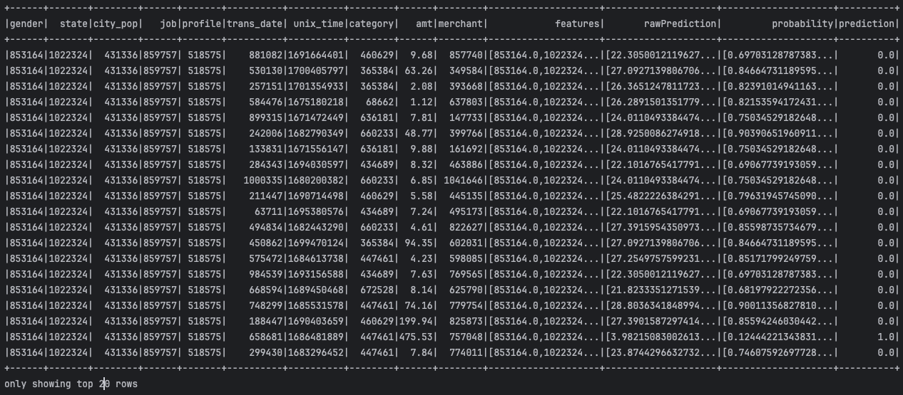
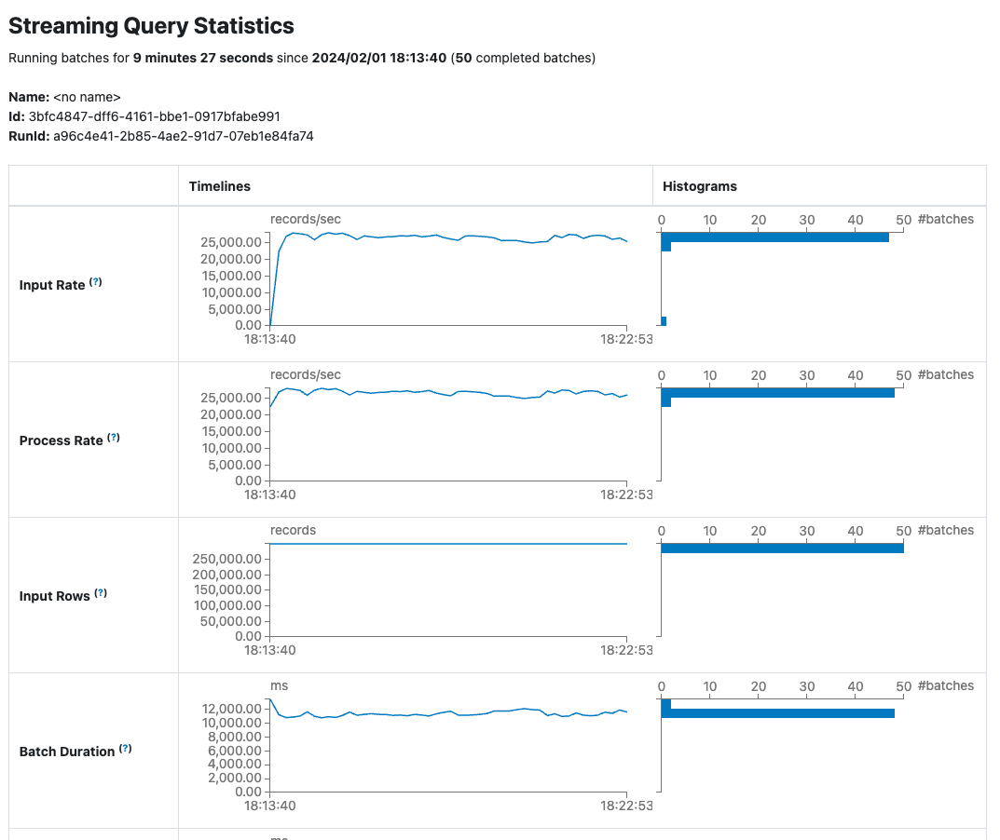
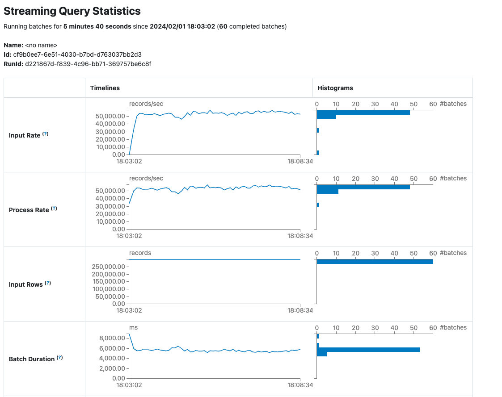

# Online Fraud Detection on Credit Card Transactions
This repository contains our project for the course "Big Data and Advanced Database System Concepts" at [Hochschule Karlsruhe](https://www.h-ka.de/) in the winter term 23/24.

We use a [Synthetic Credit Card Transaction Generator](https://github.com/namebrandon/Sparkov_Data_Generation/tree/b5eb45c89d36f2aa4ef16044a42945bed8b96d93) to generate synthetic credit card transactions that contain a label indicating fraud.
Based on these data we build two pipelines.
One for an offline training of a Random Forest Classifier, the other for an online fraud detection based on the previously trained Random Forest Classifier.

## Infrastructure Requirements
- only Mac is supported
- at least [Python 3.12.0](https://www.python.org/downloads/)
- [Docker Desktop](https://docs.docker.com/desktop/install/mac-install/) for Mac
- easiest to navigate with [PyCharm](https://www.jetbrains.com/pycharm/)
- at least [Apache Spark 3.5.0](https://spark.apache.org/downloads.html) (package type: Pre-built for Apache Hadoop 3.3 and later)

## Environment Variables
```bash
SPARK_HOME=path/to/Spark
PATH=path/to/Spark/bin
PATH=path/to/python3/version/bin
PYSPARK_DRIVER_PYTHON=python3
```

## Installation

1. Clone the repo
```bash
git clone https://github.com/antoniafeistel/BigData.git
```
2. Create a virtual environment
```bash
python3 -m venv path/to/new/virtual/environment/my_venv
```

3. Activate your virtual environment
```bash
source my_venv/bin/activate
```

4. Install requirements
```bash
pip install -r BigData/requirements.txt
```

5. Install provided Python packages
```bash
pip install -e BigData/.
```

6. Clone used submodule
```bash
git submodule update --init
```

## Architecture


## Scalability Model for the Streaming-Pipeline
For the streaming-pipeline, all components (Producer, Kafka cluster, Consumer) can be independently scaled. Thus, our architecture enables a high degree of parallelization and fault tolerance.
Moreover, fault tolerance is further improved by the topic partitions and replications used in the Kafka cluster.


## Dependency Graph


## Application Workflow

#### 1. Step: Start the Spark Cluster
Run the [start_spark.py](https://github.com/antoniafeistel/BigData/blob/main/scripts/start_spark.py) script to start the Spark cluster.\
Web UIs will be available under: "localhost:8080" and "localhost:4040".

#### 2. Step: Generate synthetic credit card transaction data for model training
You can skip step 2 and 3 if you want to use the pre-trained Random Forest Classifier (see next paragraph: Pre-trained Random Forest Classifier).

Customize the data generation within the "# Transactions generation" section of the [.env-file](https://github.com/antoniafeistel/BigData/blob/main/scripts/.env).\
However, set GEN_MODE = "train" in any case.

Run the [generate_transactions.py](https://github.com/antoniafeistel/BigData/blob/main/scripts/generate_transactions.py) script to generate synthetic credit card transaction data.\
The generated data will be saved in the respective "BigData/resouces/data/train/raw/dd_mm_yyyy_hh_mm_ss" folder.

#### 3. Step: Train the Random Forest Classifier
Set DATA_VERSION = "dd_mm_yyyy_hh_mm_ss" in the [.env-file](https://github.com/antoniafeistel/BigData/blob/main/scripts/.env) to use the respective synthetic credit card transaction data generated in step 2 for training the Random Forest Classifier.

You can customize the number of decision trees used for training the Random Forest Classifier by setting "num_trees" in [model_utils.py](https://github.com/antoniafeistel/BigData/blob/main/model/model_utils.py).\
Otherwise, the Random Forest Classifier will be trained based on 128 decision trees.

Run the [train_model.py](https://github.com/antoniafeistel/BigData/blob/main/scripts/train_model.py) script to train the Random Forest Classifier.\
The trained Random Forest Classifier will be saved in the respective "BigData/resources/models/dd_mm_yyyy_hh_mm_ss" folder.

#### 4. Step: Start the Kafka Cluster
Set DOCKER_HOST_IP to your IP address in the "# Kafka" section of the [.env-file](https://github.com/antoniafeistel/BigData/blob/main/scripts/.env).\
Moreover, you can change KAFKA_TOPIC to customize the name of the topic that will be created in the Kafka cluster.

Run the [start_kafka.py](https://github.com/antoniafeistel/BigData/blob/main/scripts/start_kafka.py) script to start the Kafka cluster.

#### 5. Step: Start the Producer
Customize the producer that will be run on the Spark cluster within the "# Producer" section of the [.env-file](https://github.com/antoniafeistel/BigData/blob/main/scripts/.env).

Run the [start_producer.py](https://github.com/antoniafeistel/BigData/blob/main/scripts/start_producer.py) script to run the producer on the Spark cluster started in step 1.

#### 6. Step: Start the Consumer
Customize the consumer that will be run on the Spark cluster within the "# Consumer" section of the [.env-file](https://github.com/antoniafeistel/BigData/blob/main/scripts/.env).

Run the [start_consumer.py](https://github.com/antoniafeistel/BigData/blob/main/scripts/start_consumer.py) script to run the consumer on the Spark cluster started in step 1.

#### 7. Step: Generate synthetic credit card transaction data stream for online fraud detection
Customize the data generation within the "# Transactions generation" section of the [.env-file](https://github.com/antoniafeistel/BigData/blob/main/scripts/.env).\
However, set GEN_MODE = "stream" in any case.

You can customize the number of CPUs used for data generation by setting "num_cpu" in [datagen.py](https://github.com/namebrandon/Sparkov_Data_Generation/blob/b5eb45c89d36f2aa4ef16044a42945bed8b96d93/datagen.py).\
Otherwise, all CPUs of your machine will be used for data generation.

Run the [generate_transactions.py](https://github.com/antoniafeistel/BigData/blob/main/scripts/generate_transactions.py) script to generate a synthetic credit card transaction data stream.\
The generated data will be saved in the respective "BigData/resouces/data/test/dd_mm_yyyy_hh_mm_ss" folder.

## Pre-trained Random Forest Classifier
We offer a [pre-trained Random Forest Classifier](https://github.com/antoniafeistel/BigData/tree/main/resources/models/pretrained/02_01_2024_18_33_00) to be used in the streaming-pipeline for online fraud detection.\
To use it, set DATA_VERSION = "pre_trained/02_01_2024_18_33_00" in the [.env-file](https://github.com/antoniafeistel/BigData/blob/main/scripts/.env).

Training details:
- Random Forest Classifier based on 128 decision trees
- Spark configuration for training: 2 Workers with each 5 CPUs and 8 GB memory
- 43,253,806 synthetic credit card transactions from 10,000 different customers used for training
- 14.07 GB raw .csv-data with a training time (including data transformation) of 18 minutes or 1.12 GB transformed .parquet-data with a training time of 15 minutes

## Step-by-step Example including Screenshots
#### 1. Starting Spark Cluster:
The Python script [start_spark.py](https://github.com/antoniafeistel/BigData/blob/main/scripts/start_spark.py) is used to start an Apache Spark instance locally.


It loads environment variables and reads the path to the Spark folder. It then executes ```start-master.sh``` and ```start-worker.sh```  script commands to start the Spark master and worker node by executing specific shell scripts within the Spark folder.

#### 2. Generate synthetic credit card transaction data for model training
First, data generation in the [.env-file](https://github.com/antoniafeistel/BigData/blob/main/scripts/.env) is adjusted with regard to the number of customers, start and end date and the generation mode.
```
# Transactions generation
NUM_CUSTOMERS = "120"                                              # can be changed by the user
TRANSACTIONS_START_DATE = "06-30-2022"                             # can be changed by the user (format: "mm-dd-yyyy")
TRANSACTIONS_END_DATE = "12-31-2023"                               # can be changed by the user (format: "mm-dd-yyyy")
GEN_MODE = "train"                                                 # to be set by the user ("train" or "stream")
```
[generate_transactions.py](https://github.com/antoniafeistel/BigData/blob/main/scripts/generate_transactions.py) generates transaction data. The data can either be saved in a test data stream or as raw training data.
The function ```generate_transactions()``` generates transactions by executing the Python script datagen.py with given arguments.

The functions ```generate_transaction_test_data_stream()``` and ```generate_raw_transaction_train_data()``` call ```generate_transactions()``` and save the generated transactions accordingly either as a test data stream or raw training data depending on how it is defined in the [.env-file](https://github.com/antoniafeistel/BigData/blob/main/scripts/.env).
 
#### 3. Train the Random Forest Classifier
Now the DATA_VERSION in [.env-file](https://github.com/antoniafeistel/BigData/blob/main/scripts/.env) is adapted to the version shown in step 2 in order to train the random forest classifier.
The number of decision trees to train the random forest classifier is set to 32.
Now the script [train_model.py](https://github.com/antoniafeistel/BigData/blob/main/scripts/train_model.py) is executed to train the model.


This Python script controls the training of a model using Apache Spark. The script identifies the path to the Python script [prepare_model.py](https://github.com/antoniafeistel/BigData/blob/139183096c72821e35853bc8f660f3a581f64cda/model/prepare_model.py), which takes over the model training. 
Finally, ```subprocess.run()``` executes the Spark submit command in the shell and thus starts the [prepare_model.py](https://github.com/antoniafeistel/BigData/blob/139183096c72821e35853bc8f660f3a581f64cda/model/prepare_model.py) script.
This performs the model training. 
For a random forest with 32 decision trees, this takes approx. 15 seconds.


This is a machine learning script that takes place within a Spark session. This code follows the usual ETL (extract, transform, load) process.

1. It uses the `pyspark.sql.SparkSession` class to create a Spark session. In doing so, ```spark = SparkSession.builder.master(path_handling.SPARK_MASTER).getOrCreate()``` initializes the PySpark session.
2. It checks whether processed training data is already available. If not, it reads in raw data, encodes it, transforms it into a format suitable for training and then calculates the weights for each class to enable balanced training.

   ```csv_read_df = spark.read.csv(...)```: Reads the CSV file.

   ```encoded_df = data_handling.encode_df(csv_read_df)```: Encodes the DataFrame.

   ```assembled_df = assembler.transform(encoded_df)```: Transforms the encoded data.

3. The transformed data is stored in parquet format, which is compact and retains the schema information: 
   ```train_df.write.mode("overwrite").parquet(path_handling.TRAIN_DATA_PATH)```

4. The model is trained: ```rf_clf_model = train_model(spark)```
5. Finally, the trained model is saved for later use: ```save_model(rf_clf_model)```

#### 4. Start the Kafka Cluster
The script [start_kafka.py](https://github.com/antoniafeistel/BigData/blob/3ea8cb3e06094c8432154fa83dff96149da5cf19/scripts/start_kafka.py) starts Apache Kafka.
```
subprocess.run(f"docker-compose -f {...", shell=True, check=True): 
```
This command starts the Docker service that hosts Kafka. The -d flag tells Docker to run in the background.
```
subprocess.run( f'docker exec kafka1...', shell=True, check=True): 
```
This command creates a Kafka topic. It uses the Docker container that was activated by the first docker-compose command. The variable KAFKA1 represents the name of the Kafka service, --topic is the name of the topic, which is derived from the environment variable KAFKA_TOPIC. 
Also the number of partitions and the replication factor are also taken from the environment variables NUM_PARTITIONS and REPLICATION_FACTOR.

#### 5. Start the Producer

The script [start_producer.py](https://github.com/antoniafeistel/BigData/blob/3ea8cb3e06094c8432154fa83dff96149da5cf19/scripts/start_producer.py) starts a producer in the Spark environment that interacts with Apache Kafka.

```python
streaming_df = (spark.
                readStream.
                option("header", data_handling.CSV_HEADER).
                option("sep", data_handling.CSV_SEP).
                schema(data_handling.schema).
                csv(path_handling.INPUT_FOLDER_TEST)
                )

encoded_df = data_handling.encode_df(streaming_df)
selected_df = encoded_df.select(data_handling.features)

query_kafka = (
    selected_df.selectExpr("to_json(struct(*)) AS value")
    .writeStream
    .format("kafka")
    .outputMode("append")
    .option("kafka.bootstrap.servers", path_handling.KAFKA_BOOTSTRAP_SERVERS)
    .option("topic", path_handling.KAFKA_TOPIC)
    .option("checkpointLocation", path_handling.KAFKA_CHECKPTS_PATH)
    .start()
)
```

In first step there is a streaming dataframe initiated. The producder is listening to any changes of the provided input folder and loads the data into the cluster. In a second step, the data has to be transformed and the feature columns have to be selected that the transformed rows are compatible with the trained ML-Model. The created kafka query provides the connection to the kafka cluster and takes over the continious transfer of the streaming data.

#### 6. Start the Consumer
The script Skript [start_consumer.py](https://github.com/antoniafeistel/BigData/blob/3ea8cb3e06094c8432154fa83dff96149da5cf19/scripts/start_consumer.py) starts a consumer in the Spark environment that interacts with Apache Kafka.

```python
csv_stream_df = (
    spark
    .readStream
    .format("kafka")
    .option("kafka.bootstrap.servers", path_handling.KAFKA_BOOTSTRAP_SERVERS)
    .option("subscribe", path_handling.KAFKA_TOPIC)
    .option("startingOffsets", "earliest")
    .option("maxOffsetsPerTrigger", 300000)
    .load()
)
...
parsed_df = csv_stream_df.selectExpr("CAST(value AS STRING)").select(from_json("value", schema).alias(data_handling.FEATURES_COL)).select(data_handling.FEATURES_COL + '.*')
assembler = VectorAssembler(inputCols=data_handling.features, outputCol=data_handling.FEATURES_COL)
assembled_df = assembler.transform(parsed_df)
predicted_df = predict(assembled_df)
```

The consumer client also creates a streaming dataframe that is listening for new records in the kafka cluster within the specified topic. The received data is then afterwards predicting the card-transactions via the trained model within a spark cluster. The consumer is then printing the results on the console as shown after step 7.

#### 7. Generate synthetic credit card transaction data stream for online fraud detection

The variable GEN_MODE = "stream" is now set in the [.env-file](https://github.com/antoniafeistel/BigData/blob/main/scripts/.env). Finally, [generate_transactions.py](https://github.com/antoniafeistel/BigData/blob/main/scripts/generate_transactions.py) is executed again and the credit card transactions can be evaluated.

**Consumer Prediction Output**


## Data Description
We have uploaded sample data for easier usage of our application.

The sample data in [resources/data/train/transformed/sample](https://github.com/antoniafeistel/BigData/tree/main/resources/data/train/transformed/sample) can be used to train the model with the [train_model.py](https://github.com/antoniafeistel/BigData/blob/main/scripts/train_model.py) script. For that, set DATA_VERSION = "sample" in the [.env-file](https://github.com/antoniafeistel/BigData/blob/main/scripts/.env) before running the script.

The sample data in [resources/data/test/sample](https://github.com/antoniafeistel/BigData/tree/main/resources/data/test/sample) can be used to run the whole application. For that, set DATA_VERSION = "sample" in the [.env-file](https://github.com/antoniafeistel/BigData/blob/main/scripts/.env) and follow the described application workflow above. Step 7 of the application workflow can be excluded as the sample data will substitute the synthetic credit card transaction data stream.

**Directory Tree and Data Usage**


**Data Generation Details with different amount of customers**
Customer    | Cores    |         Duration |             Size 
------------| --------:| ---------------: | ----------------: 
100         |        1 |        11.1079 s |          139.8 MB  
1000        |        1 |        35.9175 s |        1,450.0 MB  
10000       |        1 |         4.46 min |       13,580.0 MB  


## Scalability Analysis
The scenarios are based on the fraud creation of the the [Sparkov_Data_Generation/datagen.py](https://github.com/antoniafeistel/BigData/blob/main/Sparkov_Data_Generation/datagen.py) script. In streaming scenario, the script creates multiple batches within an endless loop with one core assigned. 

Basic Details about the amount of data that is created:
- 100 Customers
- Batch Size: ~140 MB
- Batch Creation Time: 11.1079 s

Ressource Details:
- Worker Nodes: 1
- Max. Worker Memory: 4GB
- Max. Worker Cores: 6
- Kafka Instances: 2

### Consumer Analysis
To test the scalability of the consumer client as an isolated component, initial data samples were added into the KAFKA cluster. With that starting point there the following test runs simulated with consumer ressources described below.

**Ressource Details**
Szenarien    | Executor |            Cores |            Memory | Duration
------------ | --------:| ---------------: | ----------------: | -------:
Scenario 1   |        1 |                1 |             1 GB  |   10 min
Scenario 2   |        1 |                2 |             1 GB  |   10 min
Scenario 3   |        1 |                3 |             1 GB  |   10 min
Scenario 4   |        1 |                6 |             1 GB  |   10 min

 **Consumer Performance Metrics**
 
With two data partitions on KAFKA the following performance metrics can be measured:
Szenarien    | Avg Input/ sec | Avg Process / sec 
------------ | -------------: | ----------------:  
Scenario 1   |      27,104.07 |         27,148.09
Scenario 2   |      37,509.15 |         38,499.65
Scenario 3   |      38,362.88 |         39,534,59

On the one hand, the system is able increase the consumer performance from Scenario one to scenario two by almost 40%. On the other hand, the is nealry zero performance improvement recognizable by the increase of cores from scenario two to scenario three. This behaviour belongs to the number of partitions within the KAFKA cluster. Just one consumer core can receive the data from a corresponding kafka partition. Adding more consumer cores than kafka partitions will therefore not improve the performance.

**Increasing the number of partitions to 6**

The following improvement can be seen below:
Szenarien    | Avg Input/ sec | Avg Process / sec 
------------ | -------------: | ----------------:  
Scenario 1   |      25,062.81 |         25,926.11
Scenario 2   |      40,164.43 |         41,393.25
Scenario 3   |      47,040.16 |         47,868.56
Scenario 4   |      53,100.87 |         53,704.87

Folgende Grafische Darstellung:

**Consumer Client 1 Core 1 GB Memory**

**Consumer Client 6 Core 1 GB Memory**


These grpahs and the metrics demonstrate that the performance really increases by adding more cores to the consumer component. If you compare Scenario 1 to Scenatrio 4, it can be noticed that the batch duration decreases by almost 50% whereas the process rate is increasing by more than 100%. There is at least a performance improvment by adding more ressources but the performance is not increasing proportional to the amount of added ressources (sub-linear).

### Producer Analysis
**Ressource Details**

To analyse the performance of the producer component, the following scenarios has been initiated. The fact that streaming the incoming data to kafka is faster than receiving and detecting the transactions via the ML-Model, we initiated just three scenarios with the following ressources:
Szenarien    | Executor |            Cores |            Memory | Duration
------------ | --------:| ---------------: | ----------------: | -------:
Scenario 5   |        1 |                1 |             1 GB  |   10 min
Scenario 6   |        1 |                2 |             1 GB  |   10 min
Scenario 7   |        1 |                3 |             1 GB  |   10 min

Within the default streaming behaviour, there are constantly generating new transactions. The producer ist able to proceed these tranactions permanantely to the kafka instances. Within this use case there is a bottleneck creatig by the generation of the transaction. For a real ("isolated") scalability analysis it is necessary to remove the bottleneck and generate the transactions **before** the producer starts to proceed the rows.

The following performance metrics are messaured in case the data is already stored on the system:


It can be seen that the producer is collecting the whole data from the file system and try to process the data within one single batch. To avoid this behaviour the **MaxFilesPerTrigger** variable has to set by the developer:
```python
streaming_df = (spark.
                readStream.
                option("header", data_handling.CSV_HEADER).
                option("sep", data_handling.CSV_SEP).
                option("maxFilesPerTrigger", 5).
                schema(data_handling.schema).
                csv(path_handling.INPUT_FOLDER_TEST)
                )
```
With that added configuration for performance analytics the follwoing metrics can be achieved for the scenarios described above:

 **Producer Performance Metrics (isolated)**
Szenarien    | Avg Input/ sec | Avg Process / sec  
------------ | -------------: | ----------------: 
Szenario 5   |      72,265.76 |         66,784.64
Szenario 6   |      99,024.35 |         92,833.61
Szenario 7   |     109,684.37 |        102,148.29

With more assigned ressources the producer is able to reduce the duration time to process the data by increasing the Avg Process / sec and the AVG Input / sec. Similiar to the consumer client, there is a sub-linear performance increase by adding more ressources to the component. 

**What happens if just the data increases?**

The fact, that we are in a real time processing environment is kind of special. With more generated data the specific streaming components (producer, kafka, consumer) will not process slower beacause the system is still continously processing data and not loading all the data into the cluster and then analyze it. With more generated data the limits of one major component will be reached at some point. With then generating more data, the system will not be able to process more tramsactions in the same period of time. From that point the delay between the generation of a transaction and the corresponding fraud detection will increase and the system runs in danger of increasing processing duration of one single transaction.

### Reliability Analysis

Kafka as a message broker is basically a single point of failure. To avoid this single point of failure there are two kafka instances running with an replication factor of 2. In case one of these KAFKA instances fails, the second one can cover the breakdown and the whole pipeline system is still working.

**Ressource Details**

- Producer: 1 Core  1GB Memory
- Consumer: 4 Cores 4GB Memory

Szenarien     | Kafka Instances           | Number of Partitions |  Replication Factor 
------------- | ------------------------: | -------------------: | ------------------:  
Szenario 8    |                         1 |                    1 |                  1 
Szenario 9    |                         2 |                    2 |                  2  
Szenario 10   |  first: 2, then killed: 1 |                    2 |                  2 

**Performance Metrics**
Performance   | Prod. Process Records / s | Cons. Input Rows / s | Cons. Process Records / s
------------- | ------------------------: | -------------------: | ------------------------:
Szenario 8    |                 56,162.10 |            18,355.10 |                 17,190.19
Szenario 9    |                 46,005.46 |            23,898.21 |                 24,688.39 
Szenario 10   |                 46,801.92 |            24,398.25 |                 24,711.19

The metrics show that the system is still working, when one of the kafka instances fails. The consumer client can still receive all the produced data from both partitions beacause of the replication.

The fact that kafka is used can on the other hand be fault tolreant as well. This is becoming relevant when espacially the consumer appliation fails. After that the data which is send to kafka will not lost and stored until the consumer client recovered himself. To increase the tolerance of consumer failures it is also possible to increase the number of conusmer applications. Therefore KAFKA has to make sure that the data is send to different consumer instances. In case one of these consumers fail. Kafka can send these records to other consumers and the whole processing system is still working.

Even if all consumer clients would fail in a productive environment. The data that is send to kafka will not be lost. Kakfa stores the batches until the consumer clients are back to receive the stored records. Of course there is an increased daley between the fraud detected data on consumer side and the data which has been send by the producer components.

## Questions & Answers

### Data / Use Case

Why is your problem a "big data problem"?
- Volume: yes, Menge der Daten (Many transaction data all over the world created every second) Velocity: Realtime Processing required Varierty: Receive data from different sources --> different data formats and data quality

Why can’t you solve it traditional storage/analytics/database technologies?
- Traditional databasemanagemnt systems are not designed for streaming data evaluation --> no real time detection and "traditional" batch-processing is too slow. 
  
Where does your prototype take shortcuts, what would have to be considered in real scenarios?
 - Encoding of data (hash function) -> possible collision between different values
 - ML-Model is just trained once + no hyperparameter optimization
 - Prototype is supporting just one schema of data generation
 - Producer-component is just a simulation of a real world event-source-component

### Scaling
What happens when the amount of data increases in the orders of magnitude (1x/10x/100x... or
2x/4x/8x/16x/...)?
 - Performance will decrease --> Delay between generation of single row and fraud detection of the corresponding transaction
 - To ensure "real-time-processing", it is necessary to increase hardware ressource ( kafka instances, consumer clients)

What happens if request or query intake increases ore latency conditions decrease in magnitude?
 - Same problem as described above. Processing will create delay between creation and detection --> Problem of not being real time. Fraud detection may be too late.
 
How does the "data" run through the system? Which paths are IO-bound/Memory-bound/CPU-bound?
 - IO Bound: Reading of incoming transactions by procducer component, Receiving data from Kafka
 - CPU Bound: ML-Model Training, Detect single Rows
 - IO-Bound: Encoding of Data (Read Data from csv files, encode them and store them as parquet files)

Which paths are easy/more difficult to scale? How is scaling, how are data/requests/queries
partitioned? What happens when data or queries skew and bias
 - Componentes are independent --> can be scaled independly. More explicit consumer-client applications could be more difficult to scale as a single consumer-client that is distrubtetd across the spark cluster.
 - Multiple Kafka Brokers and Partitions.
 - BIAS of lables: fraud detection (0,1) -> more 0 than 1
 - Fraud Detection depends on model training
 - Data are balanced for Model-Training

How would you dimension a real system or setup given realistic data or query sets?
 - PayPal as example (use KAFKA): 1500 Brokers, 20.000 Topics, 1,3 trillion messages a day, Anzahl Consumer: 1 Consumer (4 CPU), 1 topic -> 1 partition --> 20.000 Partitionen --> 20.000 CPus --> 5000 Consumer 

### Fault tolerance
How does the system behave under Node/CPU/Memory/Hardware/... errors and failures?
  - In case of one KAFAK-instance: KAFKA is a single point of failure.
  - -> run multiple KAFKA Instances with replication factor can cover instance failure
  - -> run multiple consumer clients can cover client failure
  - -> Spark Fault tolerance for spark model training
  
What happens during network interruptions and partitioning?
- run multiple KAFKA Instances with replication factor can cover instance failure
- run multiple consumer clients can cover client failure
  
How do error handling mechanisms affect efficiency/scale/latency/throughput/... etc.? Are there any
worst/best case considerations?
- IO-traffic caused by replication factor in KAFKA
- Possible error mechanism for wrong detection and loss of data:
- Run multiple consumers that are receiving the same data and detect them with different models --> replication of inout data and being more specific on fraud detection --> Bottleneck if multiple consumers receive data from same partition --> more network traffic

### Implementation
Which system/software/Spark/HDFS components contribute to the execution and how?
- Spark Structured Streaming, KAFKA, SparMLib, Parquet, DataGenerationRepository, Docker (for KAFKA)
  
How and with which components (executors, workers, HDFS-nodes/storage-nodes), etc., are the data
analyses/queries/queries mapped to the hardware resources (CPU/memory/disk/network)
- Consumer, Producer and Model-Training run on multiple workers with the corresponding executors and assigned CPUs and Memory. KAFKA runs in his own cluster.


